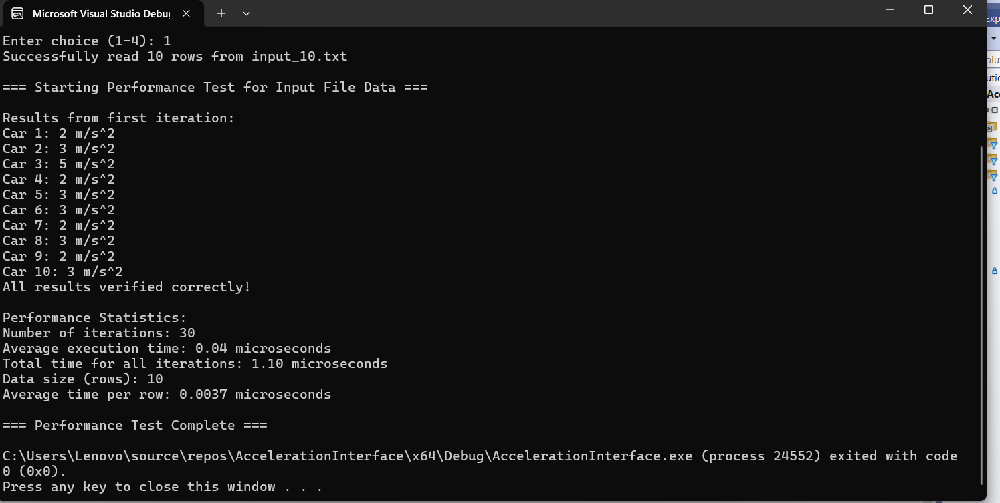
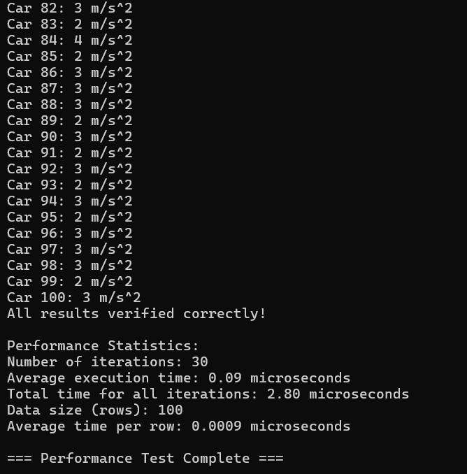
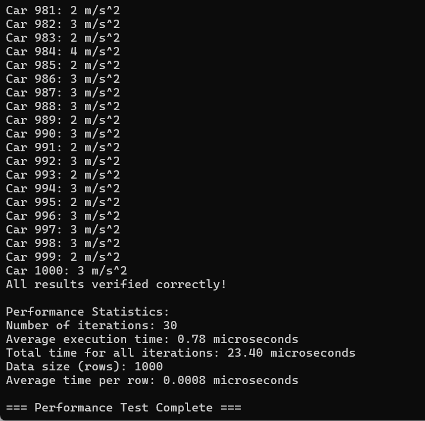
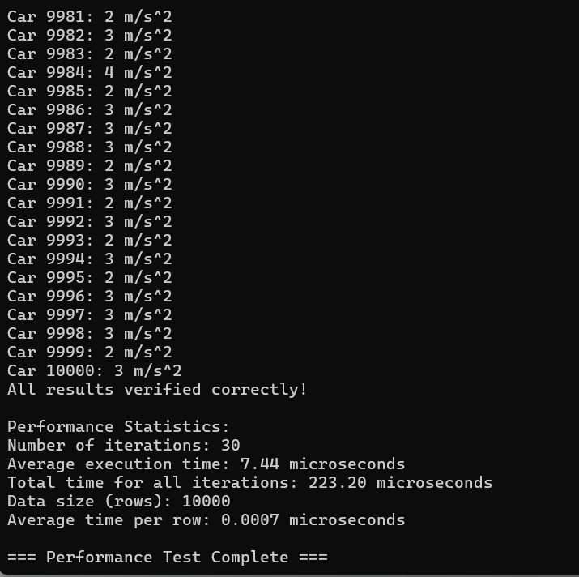

# Performance Statistics and Results

**In Fulfillment of LBYARCH by Rodriguez, Joaquin Andres Diolola and Trajano, Keisha Nicole Santos**

This project analyzes acceleration data from various input files and measures performance. Below are the performance statistics and the visual results for each dataset.

## Performance Statistics

### Input_10
- **Number of iterations:** 30
- **Average execution time:** 0.04 microseconds
- **Total time for all iterations:** 1.10 microseconds
- **Data size (rows):** 10
- **Average time per row:** 0.0037 microseconds

---

### Input_100
- **Number of iterations:** 30
- **Average execution time:** 0.09 microseconds
- **Total time for all iterations:** 2.80 microseconds
- **Data size (rows):** 100
- **Average time per row:** 0.0009 microseconds

---

### Input_1000
- **Number of iterations:** 30
- **Average execution time:** 0.78 microseconds
- **Total time for all iterations:** 23.40 microseconds
- **Data size (rows):** 1000
- **Average time per row:** 0.0008 microseconds

---

### Input_10000
- **Number of iterations:** 30
- **Average execution time:** 7.44 microseconds
- **Total time for all iterations:** 223.20 microseconds
- **Data size (rows):** 10000
- **Average time per row:** 0.0007 microseconds

